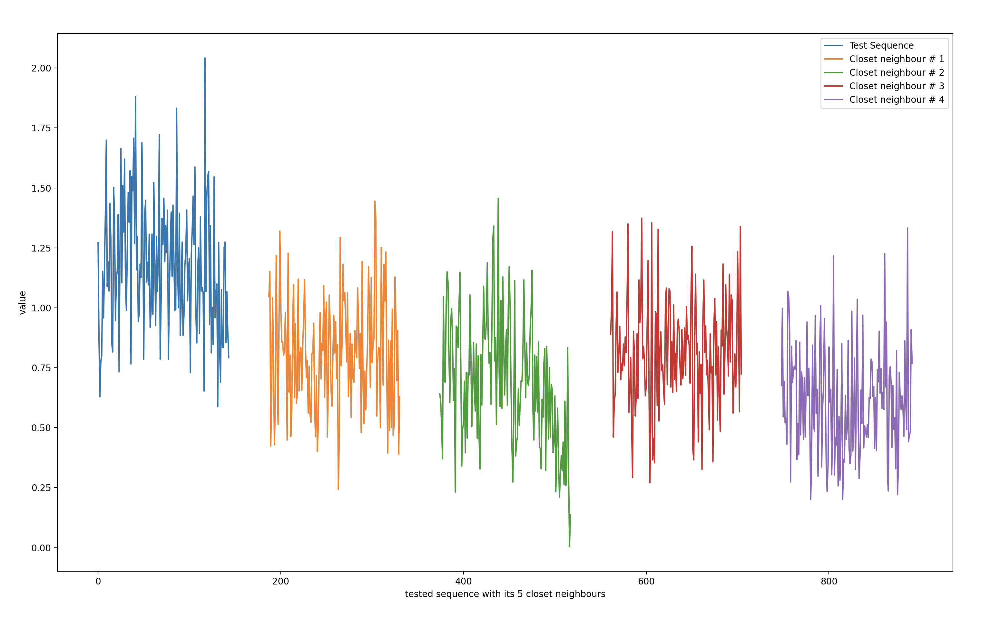

# SHAPE

## Project Description
To alleviate the challenging problems from timeseries data, such as sparsely labeled data and variable length, we combine the encoder architecture from [Unsupervised Scalable Representation Learning for Multivariate Time Series](https://proceedings.neurips.cc/paper_files/paper/2019/file/53c6de78244e9f528eb3e1cda69699bb-Paper.pdf) with the novel loss function from [TS2Vec: Towards Universal Representation of Time Series](https://ojs.aaai.org/index.php/AAAI/article/view/20881). The first paper come up with the idea to use deep neural networks with exponentially dilated causal convolutions for their encoder, but they stick to loss function similar to skip-gram word2vec. So we replace that part with the novel hierarchical contrasting from the TS2Vec paper to see if it can improve our results.

## Docker
To build the docker image, run ```docker build -t <image_name> . ``` 

To run the container with command line arguments, run ```docker run -it <image_name> --seq_length 1440 --batch_size 64 ```. ```-it``` is used to allocate a pseudo-TTY (terminal) and enable interaction with the container.

## Evaluate 
To evaluate how well the encoder behaves, we provide an knn_plot function, where user could pass how many neighbours he/she want so inspect. This program will encode all sequences based on ```TimeSeriesTestDataset```,then by using KD tree, we select ```k``` nearest neighbours from an arbitrary sequence and plot their original normalized data in the same xy-axis to see how similar they are in their original shape.

<p align="center">
  
</p>

